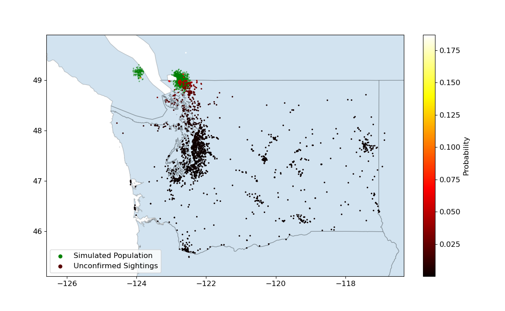

# Hornet Model

This project models and simulates the outbreak of Asian giant hornets in the northwest. Here, we have one of many possible simulated scenarios. This is plotted along with a logistic regression model which estimates the probabilty that an unconfirmed sighting is real.



## Setup

### 1. Installation

From a fresh Python3 environment, first install geopandas:

```
conda install geopandas
```

Then the rest of the dependencies:

```
pip install -r requirements.txt
```

In case there are issues, see [also](https://github.com/geopandas/geopandas/issues/1812).

### 2. Download Data Files

You will need:
* '2021MCMProblemC_DataSet.xlsx'
* 'USA_Canada_ShapefileMerge'

See [also](./data/README.md).

### 3. Running

Run the files in this order:

```
python prep_data.py
python run_sims.py
python run_regression.py
python plot_sims.py
python plot_regression.py
```

I.e. prep data -> run -> plot
